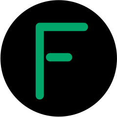

<!-- This template can be found at:  https://github.com/othneildrew/Best-README-Template -->

<a name="readme-top"></a>

<br />
<div align="center">
  <a href="https://github.com/kyrregjerstad/noroff-exam-blog-year-1">
    
  </a>

<h3 align="center">Semester Project 1 - Futeum</h3>

  <p align="center">
Futeum is a community science museum static website that I created for my semester project at my university, Noroff. It provides a platform for the museum to share the latest news, events, and exhibits with the public. The website was designed with a focus on user experience, featuring a clean, modern design and easy navigation.
    <br />
    <br />
    <a href="https://futeum.kyrre.dev">View Deployed Page</a>
  </p>
</div>

## About The Project

[![Product Name Screen Shot][product-screenshot]](https://futeum.kyrre.dev/)

### Built With

- ![HTML5][html5-badge]
- ![CSS3][css3-badge]
- ![JavaScript][javascript-badge]
- ![gsap][gsap-badge]

## Getting Started

This is an example of how you may give instructions on setting up your project locally.
To get a local copy up and running follow these simple example steps.

### Installation

1. Clone the repo

   ```sh
   git clone https://github.com/kyrregjerstad/Futeum.git
   ```

2. Navigate to the root folder of the project
   ```sh
   cd Futeum
   ```
3. That's it! Since it's a static website, you can just open the index.html file in the live server.

<p align="right">(<a href="#readme-top">back to top</a>)</p>

## Contact

Kyrre Gjerstad - [twitter: @kyrregjerstad](https://twitter.com/kyrregjerstad) - [hi@kyrre.dev](mailto:hi@kyrre.dev) - [kyrre.dev](https://www.kyrre.dev)

Project Link: [https://github.com/kyrregjerstad/Futeum](https://github.com/kyrregjerstad/Futeum)

Live Demo: [https://futeum.kyrre.dev](https://futeum.kyrre.dev)

<p align="right">(<a href="#readme-top">back to top</a>)</p>

[linkedin-url]: https://linkedin.com/in/kyrre-gjerstad
[product-screenshot]: assets/screenshot.webp
[html5-badge]: https://img.shields.io/badge/HTML5-E34F26?style=for-the-badge&logo=html5&logoColor=white
[css3-badge]: https://img.shields.io/badge/CSS3-1572B6?style=for-the-badge&logo=css3&logoColor=white
[gsap-badge]: https://img.shields.io/badge/GSAP-000000?style=for-the-badge&logo=greensock&logoColor=white
[javascript-badge]: https://img.shields.io/badge/JavaScript-F7DF1E?style=for-the-badge&logo=javascript&logoColor=black
